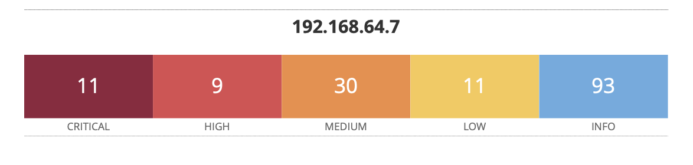

# 🛡️ Vulnerability Assessment: Metasploitable2 using Nessus

> A hands-on vulnerability scan and analysis project using Nessus Essentials on Metasploitable2 in a controlled lab environment.

---

## 📍 Project Overview

This project demonstrates a practical vulnerability assessment workflow using **Nessus Essentials** and **Metasploitable2**, a deliberately vulnerable Linux virtual machine. The goal was to identify, analyze, and report on known vulnerabilities in a simulated environment. Since the scan identified 154 vulnerabilities, I will select 20 of the most significant findings for deeper analysis — and, where appropriate, attempt safe exploitation in a controlled lab environment.

---

## 🧰 Tools & Environment

| Tool              | Role                                        |
| ----------------- | ------------------------------------------- |
| Kali Linux (VM)   | Analyst system running Nessus Essentials    |
| MacBook           | Hosting both of the guest operating systems |
| Nessus Essentials | Vulnerability scanning tool                 |
| Metasploitable2   | Target system with known vulnerabilities    |
| UTM               | Virtualization platform (both VMs hosted)   |

---

## 🖥️ Target Details

- **Target IP**: `192.168.64.7`
- **OS**: Ubuntu-based Linux (Metasploitable2)
- **Discovered Ports**: 21 (FTP), 22 (SSH), 23 (Telnet), 80 (HTTP), 139/445 (SMB),TO BE COMPLETE

---

## 🔐 Selected Vulnerabilities

For a breakdown of 20 high- and critical-severity findings from the scan, see:  
📄 [VULNERABILITIES.md](./VULNERABILITIES.md)

🔗 **Full Report**: [nessus_scan_report.pdf](./Advanced_Vulnerability_Scan-Metasploitable2_Report.pdf)

---

## 📄 Sample Findings Screenshot

---

## 🧠 Lessons Learned

- Understanding and interpreting CVE-based vulnerability data
- Risk prioritization: separating critical from informational findings
- Practical experience with one of the industry’s top vulnerability scanners

---

## 🛠️ Next Steps

- Perform safe exploitation using Metasploit Framework

---

## 📌 How to Recreate This Lab

1. Set up two VMs using [UTM](https://mac.getutm.app/):
   - **Kali Linux** (with Nessus installed)
   - **Metasploitable2**
2. Ensure both are on the same virtual network
3. Install Nessus on Kali:  
   [Nessus Download & Install](https://www.tenable.com/products/nessus)
4. Activate and scan Metasploitable2 (`192.168.64.7`)
5. Export and analyze results

---

## 🧾 Contact

\_Created by Neil Gibson  
🔗 [LinkedIn](https://www.linkedin.com/in/neil-gibson-539ab7153/)  
📧 1neilgibson1@gmail.com  
📁 Portfolio: [Github](https://github.com/Neilgibson26)

---
